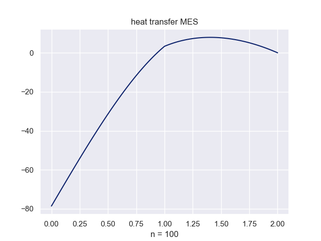

# Heating Transfer 

# Description

This project is part of a differential equations course at AGH University of Science and Technology (UST). It focuses on solving heating transfer problems using the Finite Element Method (FEM).

# Problem

The problem addressed in this project is detailed in the following document:
* [Problem - pdf](doc/zadanie_obliczeniowe_2023.pdf)

The solution to the problem is documented in the solution report:
* [Solution - pdf](doc/heating-transfer.pdf)

This report provides the results of the FEM analysis, including methodology, implementation details, and final outcomes.

# Result

Here are the results from the FEM analysis of the heating transfer problem:



# Technologies

This project uses the following technologies:

* **Python 3.10**: The programming language used for implementing the FEM solution.
* **numpy**: A library for numerical computations and handling large datasets.
* **matplotlib**: A library for generating visualizations and plots to represent the results of the heating transfer analysis.

# Setup
To run this project, follow these steps:

1. **Clone the Repository**
    Clone the repository to your local machine using the following command:
    ```bash
    git clone 
    ```

2. **Change into the Project Directory**
    Navigate to the project directory:
    ```bash
    cd heating-transfer-fem
    ```

3. **Set Up a Virtual Environment**
    It’s recommended to use a virtual environment to manage dependencies. Create and activate a virtual environment using the following commands:
    ```bash
    python -m venv venv
    source venv/bin/activate  # On Windows use `venv\Scripts\activate`
    ```

4. **Install Required Packages**
    Install the required Python packages specified in the requirements.txt file:
    ```bash
    pip install -r requirements.txt
    ```

5. **Run the Main Script**
    Execute the `main.py` script to run the analysis:
    ```bash
    python src/main.py
    ```


